# Memoria
## **Game Overview**

Memoria is a vibrant, card based, memory challenge game for all ages.
There are 6 core family friendly themes and icon sets, with 2 themes that use all icons.
Players are shown an increasing number of cards, that they need to remember, in order, to win.
It might sound simple but can you beat it?
​
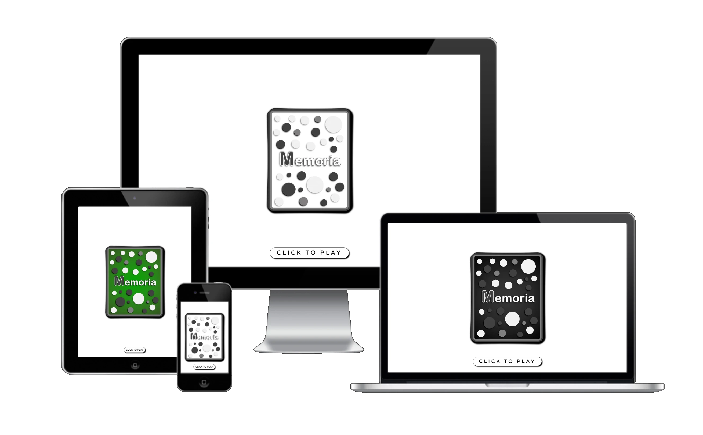
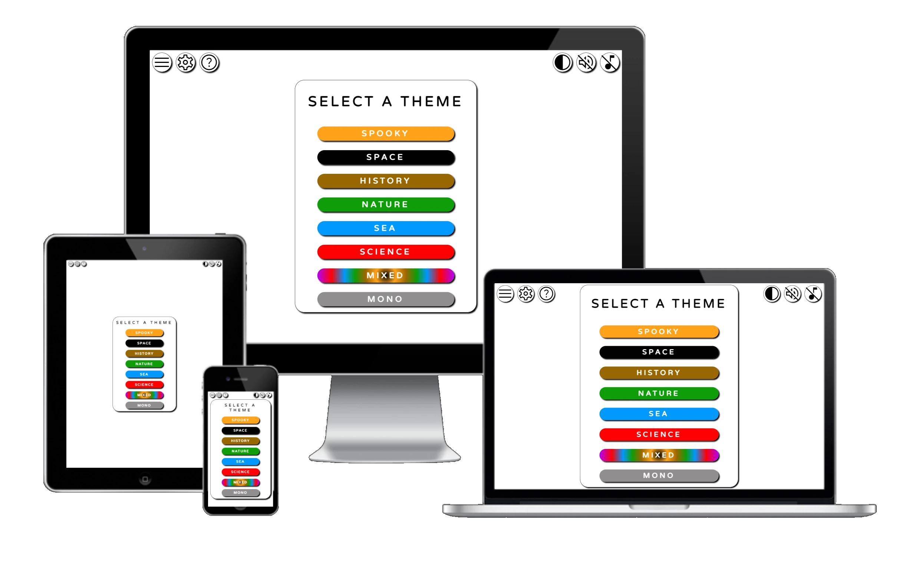
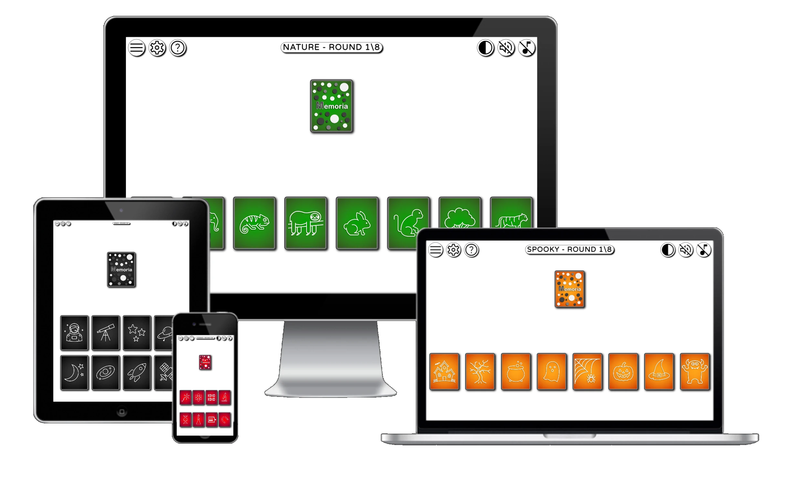

#### [The deployed website is here on GitHub Pages](https://will-griffiths-ireland.github.io/Memoria/)​

## Table of contents:
1. [**Game Overview**](#game-overview)
1. [**Planning stage**](#planning-stage)
    * [***Planning Overview***](#planning-overview)
    * [***Target Audiences***](#target-audiences)
    * [***User Stories***](#user-stories)
    * [***Game Aims***](#game-aims)
    * [***Wireframes***](#wireframes)
    * [***Color Scheme***](#color-scheme)
    * [***Design Choices***](#design-choices)
1. [**Game Features**](#game-features)
    * [***Intro***](#intro)
    * [***Player Greeting***](#player-greeting)
    * [***Theme Menu***](#theme-menu)
    * [***Menu Icons***](#menu-icons)
    * [***Main Game***](#main-game)
    * [***Victory Animation***](#victory-animation)
    * [***Awards***](#awards)
    * [***Music and Effects***](#music-and-effects)
    * [***Settings***](#settings)
1. [**Testing Phase**](#testing-phase)
    * [***Validators***](#validators)
1. [**Deployment**](#deployment)
1. [**Technology**](#technology)
1. [**Future-Enhancements**](#future-enhancements)
    * [***User Enhancements***](#user_enhacements)
    * [***Internal Enhancements***](#internal_enhacements)
1. [**Credits**](#credits)
    * [**Honorable mentions**](#honorable-mentions)
    * [**Content**](#content)
    * [**Media**](#media)

---

## **Planning Stage**

### **Planning Overview:**

My aim with the game was to create something simple and engaging that helps the player flex their memory muscle.
There are benefits to both children and adults when they engage in an activity that stimulates memory.
When planning Memoria I kept my focus on the player and making a memory game that had a really simple core gameplay loop, but had an increasing memory challenge factor.
My main aims for the game were…

* Easy initial rounds give player satisfaction but quickly get challenging
* Clean interface to emulate a big tidy table
* Distinctive cards with the same ‘feel’ as regular playing cards
* Multiple themes linked to a colour and a set of related icons
* Easily rememberable icons that are clear at small screen sizes
* Engaging animations that add to the player experience and contribute to the challenge
* Progression in difficulty with rewards that drive the player to come back
* Storing player details, settings, and progression
* Allowing some level of customization the player could select
* A mode that would push even the best memories to the limit
* A hidden 'Easter Egg' theme

### **Target Audiences:**

* Children of any ability level
* Adults looking for a quick game with a challenge
* Adults with neurological conditions, such as Alzheimer's or dementia that can benefit from cognitive stimulation

### **User Stories:**

* As a player, I want the game to load quickly on my device
* As a player, I want a fun and engaging experience
* As a player, I want to have a clear objective that provides a challenge
* As a player, I want progression and reward
* As a player, I want to save my game settings
* As a player, I want options to configure the game specifically to me
* As a player, I want to configure the game to match my devices abilities
* As a player, I want quick access to control audio
* As a player, I want feedback on success or failure

### **Game Aims:**

* The game should, scale the interface to the users device
* The game should, allow the player to zoom the interface and scale proportionally
* The game should, present the user with multiple game themes
* The game should, provide detail on how to play
* The game should, show the players existing achievements or awards
* The game should, save any settings the player modifies
* The game should, start muted and allow players to enable effects and music
* The game should, allow the player to switch between light and dark theme
* The game should, look professional and visually interesting
* The game should, tell the player when they win/loose

### **Wireframes:**

The initial wireframes were a few pages as I was aiming for a really clean interface.
I had a good idea of the look I wanted. The design did evolve during dev but nothing major from my original vision

​
### **Color Scheme:**

The core color scheme for the UI is black (#000000) and white (#ffffff)
The icons and menus were designed with high contrast in mind.
The user has the ability to quickly change between light/dark, I carefully designed the UI to maintain contrast at all times.
Hover events use red #FE0002.
Drop shadows use black.

Grey (#908e8ef4) is used to add some variation in the settings menu for example while staying neutral to the users preference of dark/light theme.
Note the use of alpha transparency (#fffffff4) on the modal background colours. This allow for both a sense of depth and also knocks down the vibrance of the white menus when the user has picked dark mode.

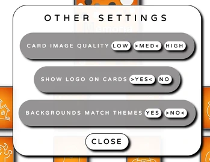
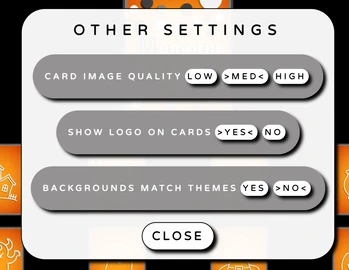

The star of the game is the cards and I've done my best to create vibrant assets with depth and character.
The core colors use gradients to give them a 3d element.

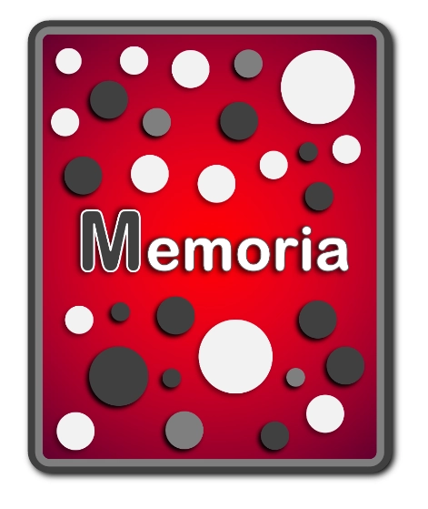

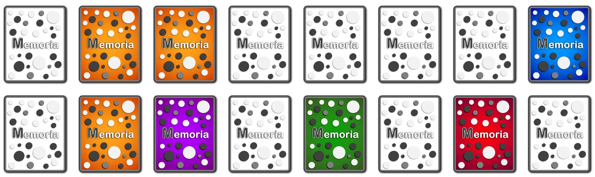
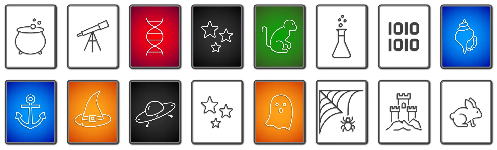

### **Design Choices**
​
The overall esthetic I based around the cards. The tactile feel and rounded edges are something I've tried to seed throughout the game.
Menus are rounded, buttons are rounded, cards are rounded off.
The entire experience is designed to be smooth and relaxing(ish).

#### **Fonts**

The font used on the cards was Arial Rounded MT Bold.
The UI uses Varela Round from Google Fonts with a fallback to sans-serif.

I made the decision to use uppercase across everything in the UI. After testing different styles it just felt like the right fit for readability and the look I wanted.

#### **Animations**

The flow of the game is smooth with objects 'dropping' in from 0 opacity and larger scales. Cards have a flip animation that is not only for esthetics but plays an important part in the gameplay loop.

The delay in player card selection is deliberate and drives them to commit cards to short term memory rather than pure memory reflect reactions.

Other animations aim to give smooth transitions between menus and the main game.

#### **Accessibility**

The colours are high contrast, the card assets are all distinct colours.

The dark/light switch accommodates those with possible light sensitivity.

I designed it so colour matching is not important across all but the mixed mode. If the player has some sensitivity to colour they can play in mono mode with the entire selection of all icons.

The interface is is designed with a break at 900px width and a step up in all the units, this covers smaller mobile/tablets and then larger displays (I've tested this from phone screens up to a 4k TV). The use of rem across all the UI allows the player to zoom or shrink as required to meet any individual needs outside of the default scaling I designed for.

I gave a lot of consideration to those with reduced motion preferences for animations and I did try to implement a setting but I found this became very jarring with the way I had designed the game.
From an animations perspective I see it as a future enhancement to create a whole new display function that utilizes other methods such as onscreen timers.

---
​
## **Game Features**

### **Intro**

The intro screen gives the player a feel for the game. I have a stacking animation that uses 16 random cards and slows down on the final card that is back face up and shows the Memoria logo.

The click to continue button drops in quickly so that a returning player can skip the animation.

#### *Desktop @1080p Example*

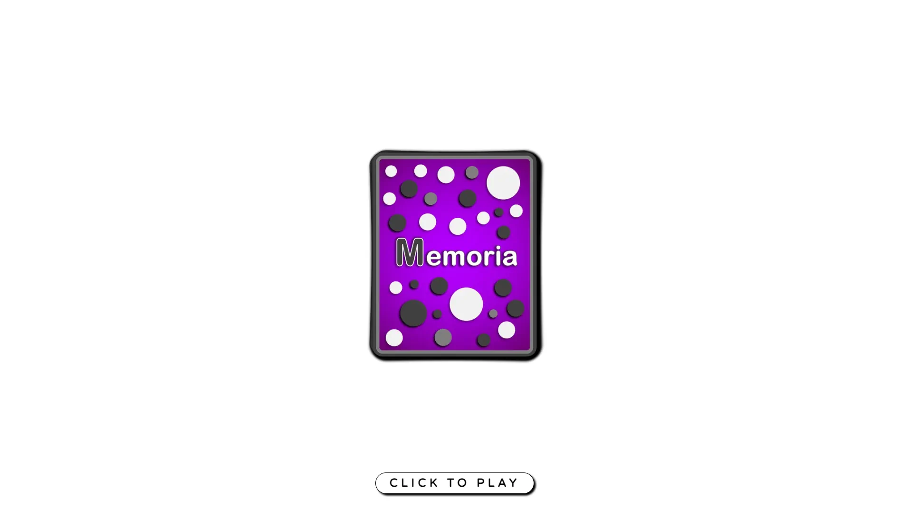

#### *Mobile Example*

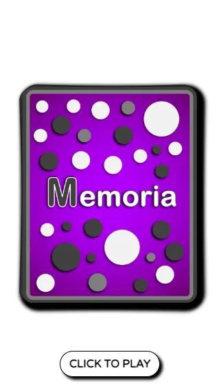

### **Player Greeting**

A new player is greeted with a modal that welcomes them and asks for a name.

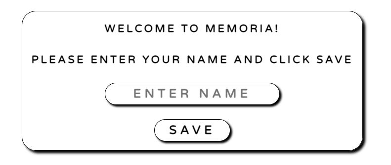

For returning players their name is fetched from local storage and used in the greeting.

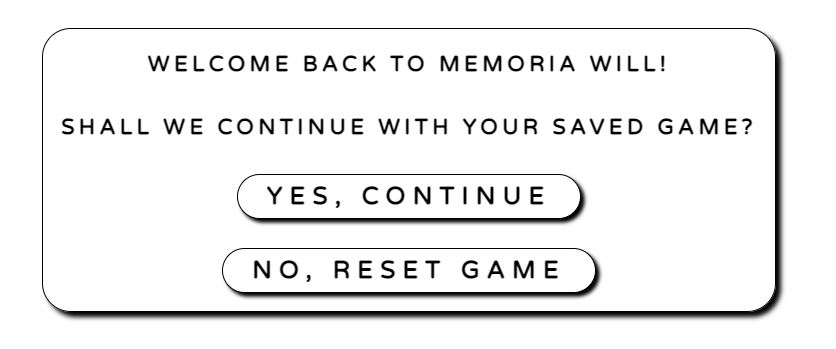

They are given the option to continue with the settings and progress, or reset.

If the player clicks reset they get a refreshed warning on the button.

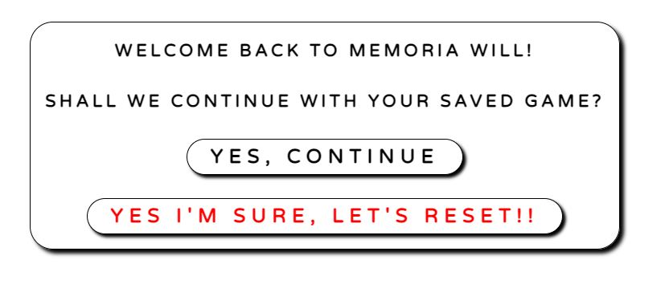

### **Theme Menu**

* The theme menu displays all the different game themes to the user to select from.
* The background colour of the buttons is matched to the cards overall colour.
* The mixed mode button is a radial gradient of all the other colours.
* Hover event triggers letter spacing increase rather than using red

#### *Desktop @1080p Example*

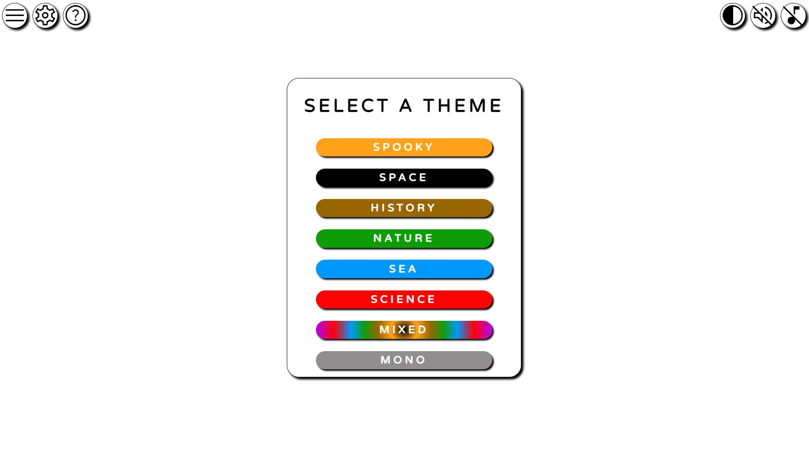

#### *Mobile Example*

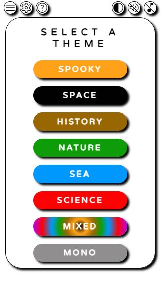

### **Menu Icons**

* Provide instant access to menus and settings at all stages of play

The menu icon brings up theme selection or screen to end game

The Settings icon display additional player configurable settings

The Help/How to Play Icon brings up a short guide on how to play the game
I deliberately didn't auto show this modal as folks tend to skip stuff when they jump into a game. It's there for when they need it.

The light/dark theme icon allows the player to switch between white and black.
This button still works when the user has game background theme matching on. This is so they can revert from the theme background colour for that game.

The effects icon disables/enables sounds.
The icon updates to reflect the setting

The music icon disables/enables music

### **Main Game**

* The main game has 2 sections
* The cards the player needs to recall are shown in the top half of the screen
* The players deck is in the lower half.
* The cards increase each round
* The player gets a short period of time to study and remember the cards and their order before they get flipped.
* Next the player is given a copy of the deck to select the matching cards from.
* They need to wait till their cards are flipped to start making selections
* After each player selection they must wait for the card to be flipped.
* The top of the screen has a display of the theme and current/total rounds

#### *Desktop @1080p Example*

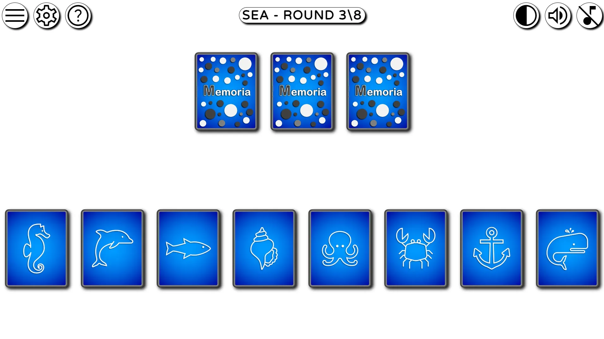

#### *Mobile Example*

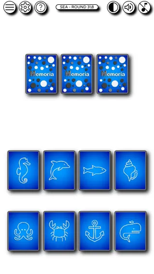

### **Victory Animation**

* When the player completes a round they get a message at the top of the screen
* A sound effect plays 'well done' if enabled
* The screen is peppered with smiles in random locations, these scale in number each round

#### *Desktop @1080p Example*

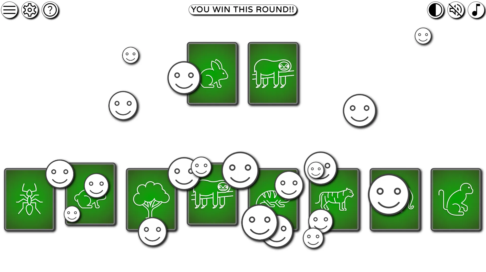

#### *Mobile Example*

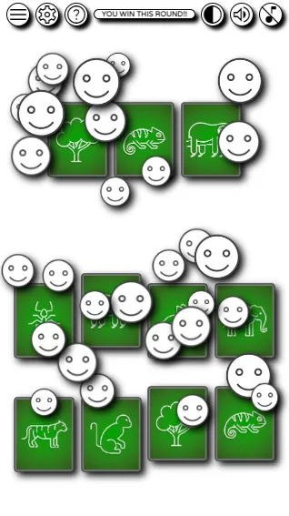

### **Awards**

* As the player completes 4/6/8 rounds in a theme they unlock theme awards
* The award displays as a star next to that theme
* All award levels are saved in local storage and persistent  

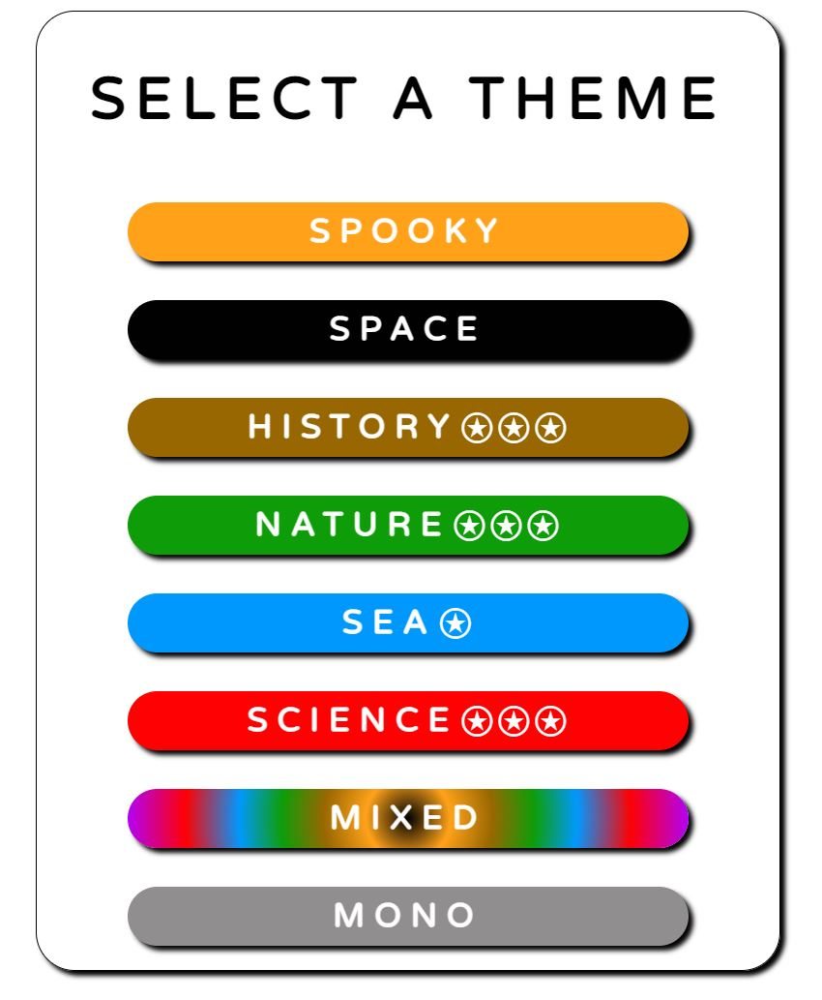

### **Music and Effects**

* Each theme and the theme menu have custom music
* My primary focus was the code so I didn't have as much time as I would have liked to produce them.
* I have written functions to populate html with the audio files and play the tracks on demand.
* I created a function to fade out tracks when switching between the main game and the menu, or disabling music.
* I created some basic sound effects which I believe work well at giving the player feedback and building immersion.

### **Settings**

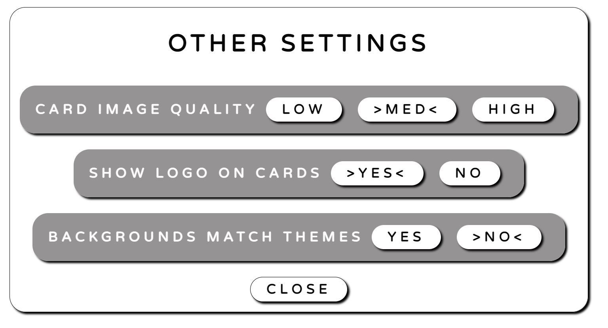

* The settings menu provides access to settings not assigned to menu icons
* The settings menu allows new values to be selected and updates to reflect the change
* All settings are maintained in local storage when player changes them from the defaults
* The card image quality allows the player to select low (very small files), medium (default - mid sized and compressed) or high (full res webp lossless) - a decent modern pc can easily handle high mode and they look fab at 4k res!
* The show logo on cards lets the player pick if the Memoria logo is shown
* The final setting allows the player to select if the background of each theme relates to the core card colour

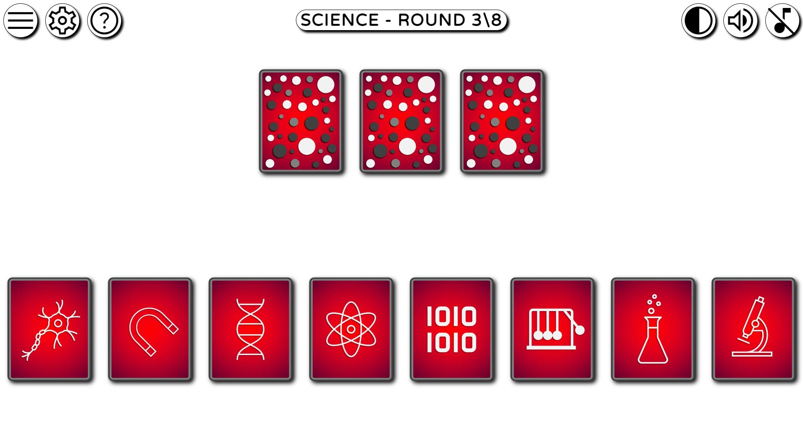

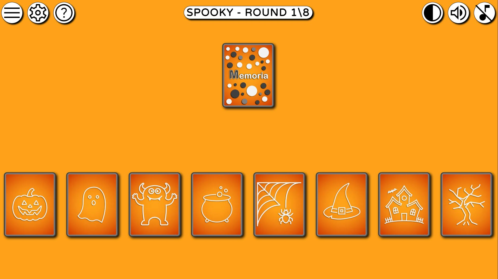
---
## **Testing Phase**

Throughout development I thoroughly tested each piece of code from a core logic perspective and a visual one, before commits.
My approach to testing is to do everything I can, from an end user perspective, to break the application. Always expect the unexpected click!
Please note all testing code & comments were removed from final production code.
The general dev cycle testing procedure was..

* Add console logging for every variable
* Verify results of calculations were as expected
* Add console logging of all function executions and conditional tests
* Verify outcomes were as expected
* Using Chrome Devtools verify DOM manipulations were successful and as expected
 

A suite of final tests were performed once I felt the application was code complete.
These are based around the end to end player journey as a new and returning player.
Tests were done across...
* Chrome(Windows)
* Firefox(Windows) 
* Edge(windows)
* Safari(IpadOS) (limited availability to test)
* Chrome(Android)
* Samsung Internet(Android)
* Steam Deck (Chrome on Linux)

To save screen space below the result field will be a combination of all platforms and notes will call out details of any failures or issues

Note - I did get it running fine on a Steam Deck. Here are some images

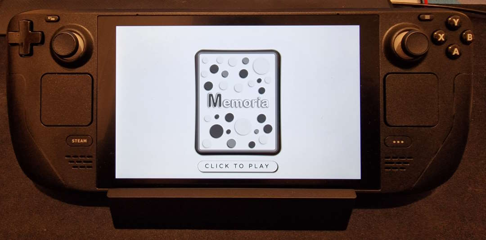
----
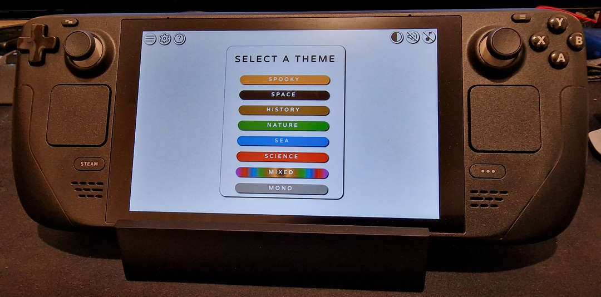
----
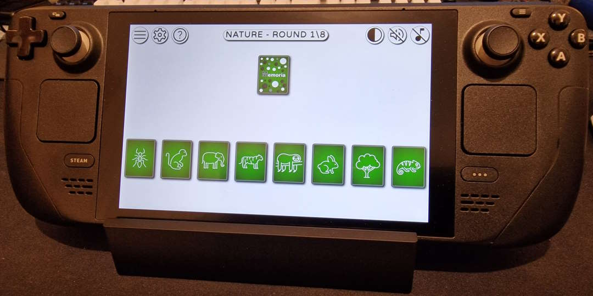

 

### 1. Verify that intro screen displays correctly and interaction is successful

| Sub Test | Result | Note | 
| ----------- | ----------- | ---- |
| Loads OK | Pass |  |
| Rendering is fluid | Pass |  |
| Continue button displays | Pass |  |
| Click/tap results in user capture screen| Pass |  |
| Image & Text clear| Pass | |

### 2. Verify that player greeting displays correctly and interaction is successful

| Sub Test | Result | Note |
| ----------- | ----------- | ---- |
| Name entry works | Pass |  |
| Modal is centered and text clear | Pass |  |
| Returning player greeted with name | Pass |  |
| Returning player given continue option | Pass | |
| Returning player provide reset game option | Pass | |
| Reset game tap/click shows red confirm warning | Pass | |

### 3. Verify main menu displays correctly and interaction is successful

| Sub Test | Result | Note |
| ----------- | ----------- | ---- |
| Menu centered | Pass | |
| Theme names display | Pass | |
| Emma theme shown is username of Emma was used | Pass | |
| All menu icons displaying | Pass | |
| Theme award stars display if any achieved | Pass | |
| Music on/off changes icon and starts/stops menu music | Partial Pass | No fade in IOS due to system limitations on volume access |
| Effects on/off changes icon and enables/disables effects  | Pass | |
| All themes trigger game of that theme type | Pass | |
| Menu icon triggers opening or closing of menu | Pass | |
| Escape key triggers opening or closing of menu (PC) | Pass | |
| Layout scales with browser zoom  | Pass | |
| Animations and transitions correct  | Pass | |
| Game tutorial icon triggers tutorial display  | Pass | |
| Other settings icon triggers other settings menu  | Pass | |
| Menu icon clicks close current modal if one is open  | Pass | |
| Any player configured options are restored  | Fail | Issue - 2 settings were not being loaded - Fix - added them to the loadSettings function|

### 4. Verify main game works as expected and responds to player input

| Sub Test | Result | Note |
| ----------- | ----------- | ---- |
| Starts at round 1 on initial launch | Pass |  |
| Theme and round count display | Pass |  |
| Layout scales with browser zoom  | Pass |  |
| Cards to match display | Pass |  |
| If enabled menu music fades and game music starts | Partial Pass | IOS no fade |
| If enabled effects play | Partial Pass | IOS will only play effects directly lined to user actions |
| Animations timings correct | Pass |  |
| Player can select card | Pass |  |
| Correct card selection results in card to match be flipped | Pass |  |
| Correct card selection results round counter displaying win message | Pass |  |
| All correct cards selected shows win animation | Pass |  |
| All correct cards selected shows win message in round counter | Pass |  |
| Incorrect card selection results in all cards being shown | Pass |  |
| Incorrect card selection shows round counter displaying lose message | Pass |  |
| Incorrect card selection results in fade back to main menu | Pass |  |
| Incorrect card selection results, if enabled, in game music fade and menu music play | Pass |  |
| Clicking light/dark switch icon switches background and overrides theme matching | Fail | Issue - Mixed mode uses background instead of backgroundColor Fix was to add code to clear the background value in the switching function |

### 5. Verify that the additional settings menu functions correctly

| Sub Test | Result | Note |
| ----------- | ----------- | ---- |
| Opens and items display as they are saved | Pass |  |
| Image quality can be set and refreshes | Pass |  |
| Card back face display can be set and refreshes | Pass |  |
| Theme colour match background mode can be set and refreshes | Pass |  |
| All changed settings are reflected in global vars | Pass |  |
| All changed settings stored to local storage | Pass |  |

### **Validators**

#### *HTML Validator*

Since nearly all the html is injected by Javascript the HTML validator does not have much to check

| File | Result | Comments |
| ----------- | ----------- | ---- |
| index.html | Pass | N\A |

Screenshot

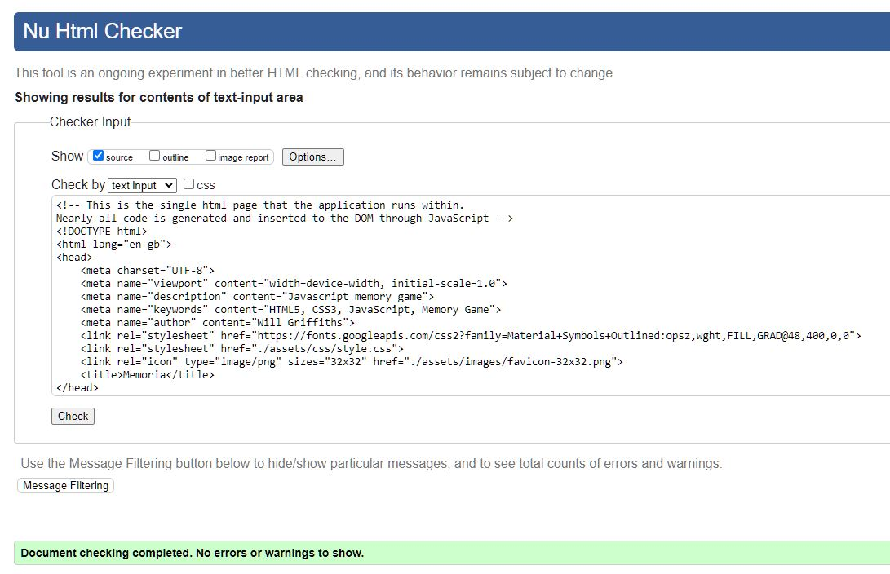

----

#### *CSS Validator*

| File | Result | Comments |
| ----------- | ----------- | ---- |
| style.css | 16 Errors | The validator is flagging properties for not existing |

The rotate property is valid and I'm using it to slightly rotate dropping cards for an intro screen.
See - https://www.w3schools.com/cssref/css_pr_rotate.php

Screenshot

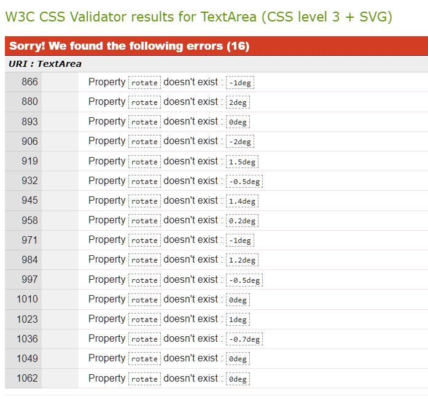

----

#### *Lighthouse Results*

Lighthouse scores are fair but ultimately not very telling on the apps performance.
I did encounter issues with the time it took for the google icon font pack to download but from my testing this seems to vary with the time of day and doesn't impact usability.

*Desktop*

*Mobile*

#### *JSHint*

I ran the code through JShint and cleaned up a few unused vars and missing semicolons.

The most striking thing was the cyclomatic complexity of 16 in one function.

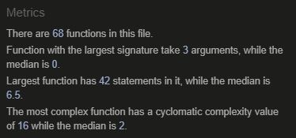

## **Defects**

Rigorous testing of my code while I built it paid off when it came to testing the end product.
I don't feel I have any major defects outside of platform specific problems.

I did find a few bugs in my final testing that were not covered by specific tests...

Issue - Player can click on a previously selected cards and trigger game over.
Fix - Removed event listener from card once its click event fires. I was positive I already have this code in there but must have removed it at some stage.

Issue - Theme Beat audio effect was playing over the round well done effect.
Fix - Moved the playback call to when we show the main menu again.

### **Unresolved**

The main outstanding issue is display glitches on MAC/IOS/IpadOS which although minor, along with the challenges with playing sounds consistently. If I had hardware to test on more then I'd do more work with the various css webkit extensions that might resolve things.

## **Deployment**
I deployed the page on GitHub pages via the following the standard procedure: -
​
1. From the project's [repository](https://github.com/Will-Griffiths-Ireland/Mars-Colony-One), go to the **Settings** tab.
2. From the left-hand menu, select the **Pages** tab.
3. Under the **Source** section, select the **Main** branch from the drop-down menu and click **Save**.
4. A message will be displayed to indicate a successful deployment to GitHub pages and provide the live link.
​
You can find the live site via the following URL - [live webpage](https://will-griffiths-ireland.github.io/Memoria/)

Deployment to another host is also possible

1. From the project's [repository](https://github.com/Will-Griffiths-Ireland/Mars-Colony-One), click **Code**.
2. Under the local tab click *Download Zip*.
3. Extract the files and copy them over to a webserver of your choice.

### **To fork the repository on GitHub** 
  
To make a copy of this GitHub repository that allows you to view the content and make changes without affecting the original repository, please take the following steps:
  
1. Login to <b>GitHub</b> and find [this repository](https://github.com/Will-Griffiths-Ireland/Memoria).
2. Locate the <b>Fork</b> button in the top, right hand side of the page.
3. Click on the <b>Fork</b> button to create a copy of the repository in your GitHub account.
4. Enjoy yourself and be creative, I welcome feedback if you have any to give!

---
​
## **Technology**
​
These are the technologies used for this project.

- HTML5
- CSS3
- Javascript (vanilla)
- Powerpoint (cards)
- Balsamiq for wireframes
- Paint.net (Image editing/sizing/compression)
- XnCovert (image resizing)
- Audacity (Sound Editing)
- Garage Band (Song Creation)
- Github for version control and deployment
- Gitpod for development
- FontAwesome for Icons
- https://cssgradient.io/ (gradient code generator)
- https://favicon.io/favicon-generator/ 

----

## **Future-Enhancements**

### **User Enhancements**

* The music needs work :)
* Adding a mode that doesn't use animations at all but still has the mechanics of making the player pause for a second or 2 before selecting cards.
* Multiple saved states in local storage all connected to the username and parsing keys/values for their related settings.
* Augmenting the 'low' quality card image mode with a 'pixel art' setting would be cool but a lot of hands-on crafting. 

### **Internal Enhancements**

* Modularize JS into multiple files and use import/export (I know I could have just split the file up and loaded in multiple tags but thats not useful in production environments )
* Refactor code further to reduce size and structure. This was my first JS application and I have learned so much on the journey thats its hard to resist the urge to change things just before submission!

## **Credits**
### **Honorable mentions**
​
Thanks to my mentor Richard who provided valuable input.
Thanks to the multiple talented folks across the globe that put effort into producing tutorials and guides.
Just to name a couple..
- Kevin Powell https://www.youtube.com/@KevinPowell
- developedbyed https://www.youtube.com/@developedbyed

​
### **Content:**
​
The game concept is my original idea. I took some inspiration from a video by developedbyed https://youtu.be/-tlb4tv4mC4 but I really tried to go and do my own thing rather than copy any of his code. 

  
### **Media:**
​
* All images were self created in MS Powerpoint using inbuilt icons
* All sound effects and music were self created using Audacity and Garage Band

