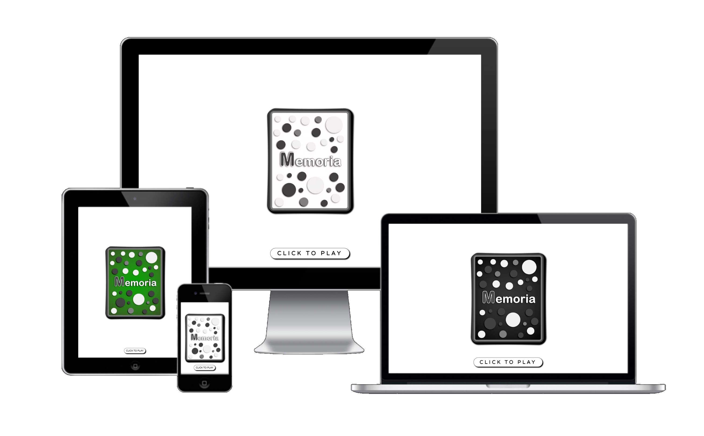
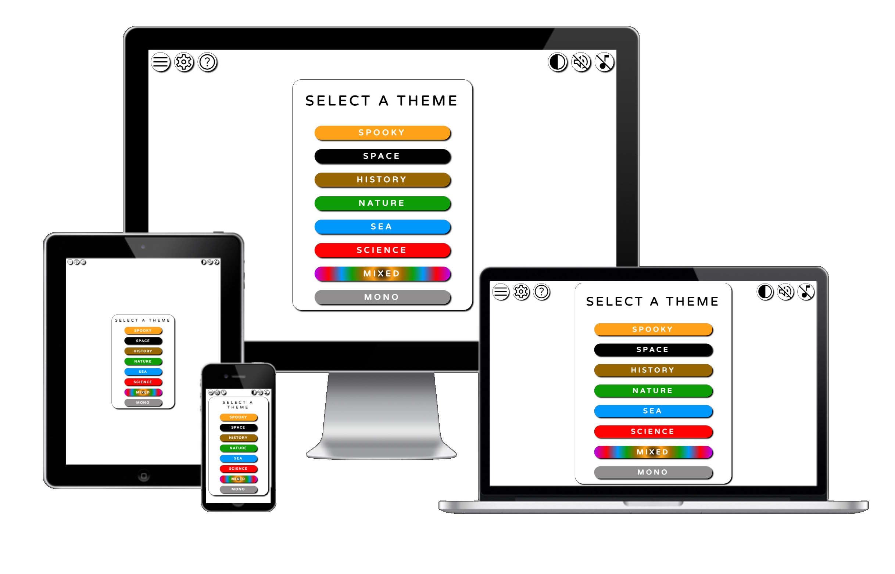
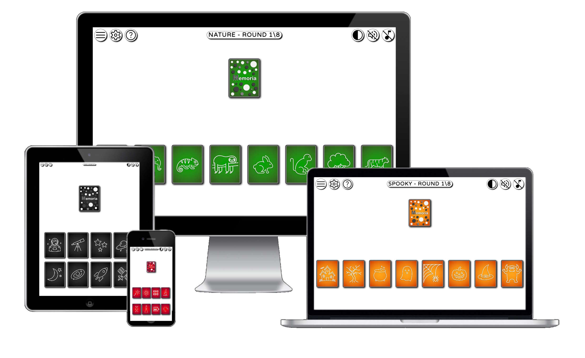
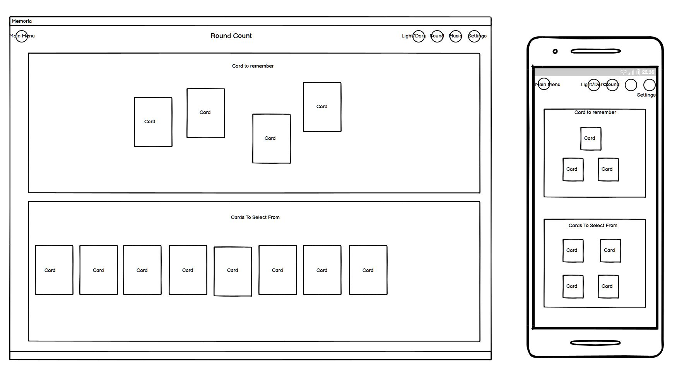
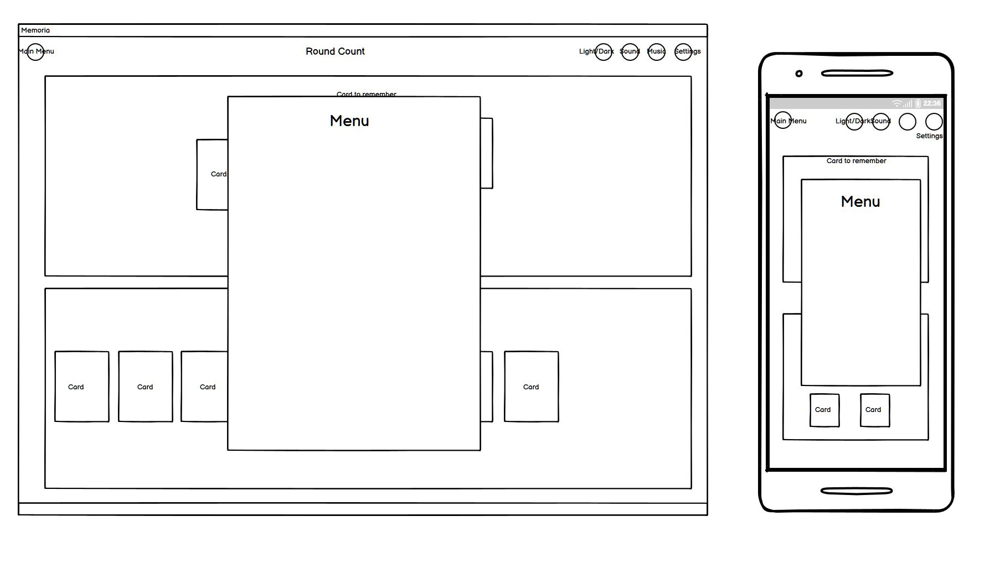

# Memoria
## **Game Overview**

Memoria is a vibrant, card based, memory challenge game for all ages.
There are 6 core family friendly themes and icon sets, with 2 themes that use all icons.
Players are shown an increasing number of cards, that they need to remember, in order, to win.
​

#### [The deployed website is here on GitHub Pages](https://will-griffiths-ireland.github.io/Memoria/)​

## Table of contents:
1. [**Game Overview**](#game-overview)
1. [**Planning stage**](#planning-stage)
    * [***Planning Overview***](#planning-overview)
    * [***Target Audiences***](#target-audiences)
    * [***User Stories***](#user-stories)
    * [***Game Aims***](#Game-aims)
    * [***Wireframes***](#wireframes)
    * [***Color Scheme***](#color-scheme)
    * [***Typography***](#typography)
1. [**Game Features**](#game-features)
    * [***Intro***](#intro)
    * [***Player Name***](#player-name)
    * [***Theme Menu***](#theme-menu)
1. [**Testing Phase**](#testing-phase)
    * [***Validators***](#validators)
1. [**Deployment**](#deployment)
1. [**Technology**](#technology)
1. [**Future-Enhancements**](#future-enhancements)
    * [***User Enhancements***](#user_enhacements)
    * [***Internal Enhancements***](#internal_enhacements)
1. [**Credits**](#credits)
    * [**Honorable mentions**](#honorable-mentions)
    * [**Content**](#content)
    * [**Media**](#media)

---

## **Planning Stage**

### **Planning Overview:**

My aim with the game was to create something simple and engaging that helps the player flex their memory muscle.
There are benefits to both children and adults when they engage in an activity that stimulates memory.
When planning Memoria I kept my focus on the player and making a memory game that had a really simple core gameplay loop, but had an increasing memory challenge factor.
My main aims for the game were…

* Clean interface to emulate a big tidy table
* Distinctive cards with the same ‘feel’ as regular playing cards
* Multiple themes linked to a colour and a set of related icons
* Easily rememberable icons that are clear at small screen sizes
* Engaging animations that add to the player experience and contribute to the challenge
* Progression in difficulty with rewards that drive the player to come back
* Storing player details, settings, and progression
* Allowing some level of customization the player could select
* A mode that would push even the best memories to the limit
* A hidden 'Easter Egg' theme

### **Target Audiences:**

* Children of any ability level
* Adults looking for a quick game with a challenge
* Adults with neurological conditions, such as Alzheimer's or dementia that can benefit from cognitive stimulation

### **User Stories:**

* As a player, I want the game to load quickly on my device
* As a player, I want a fun and engaging experience
* As a player, I want to have a clear objective that provides a challenge
* As a player, I want progression and reward
* As a player, I want to save my game settings
* As a player, I want options to configure the game specifically to me
* As a player, I want to configure the game to match my devices abilities
* As a player, I want quick access to control audio
* As a player, I want feedback on success or failure

### **Game Aims:**

* The game should, scale the interface to the users device
* The game should, allow the player to zoom the interface and scale proportionally
* The game should, present the user with multiple game themes
* The game should, provide detail on how to play
* The game should, show the players existing achievements or awards
* The game should, save any settings the player modifies
* The game should, start muted and allow players to enable effects and music

### **Wireframes:**

The initial wireframes were a few pages as I was aiming for a really clean interface.
I had a good idea of the look I wanted.

​
### **Color Scheme:**

The core color scheme for the UI is black (#000000) and white (#ffffff)
The icons and menus were designed with high contract in mind.

grey is used to add some variation while staying nuetral to the users preference of dark/light theme

The star of the game is the cards and I've done my best to create vibrant assets with depth and character.
The core colors use gradients to give them a 3d element

### **Design & Font**
​
??

---
​
## **Individual  features**

### **Intro Page Content**

* ??

#### *Desktop @1080p Example*

??

#### *Mobile Example*

??

---
## **Testing Phase**

Throughout development I thoroughly tested each piece of code from a core logic perspective and a visual one, before commits.
My approach to testing is to do everything I can, from an end user perspective, to break the application. Always expect the unexpected click!
Please note all testing code & comments were removed from final production code.
The general dev cycle testing procedure was..

* Add console logging for every variable
* Verify results of calculations were as expected
* Add console logging of all function executions and conditional tests
* Verify outcomes were as expected
* Using Chrome Devtools verify DOM manipulations were successful and as expected
 

A suite of final tests were performed once I felt the application was code complete.
These are based around the end to end player journey

1. Verify that intro screen displays correctly and interaction is successful

| Sub Test | Chrome(Windows) | Firefox(Windows) | Edge(windows) | Safari(IpadOS) | Chrome(Android) | Samsung Internet(Android) |
| ----------- | ----------- | ---- | ---- | ----- | ----- | ---- |
| Loads OK | Pass | Pass | Pass | Pass | Pass | Pass |
| Rendering is fluid | Pass | Pass | Pass | Pass | Pass | Pass |
| Continue button displays | Pass | Pass | Pass | Pass | Pass | Pass |
| Click/tap results in user capture screen| Pass | Pass | Pass | Pass | Pass | Pass |
| Image & Text clear| Pass | Pass | Pass | Pass | Pass | Pass |

Notes - None

2. Verify that user greeting displays correctly and interaction is successful

| Sub Test | Chrome(Windows) | Firefox(Windows) | Edge(windows) | Safari(IpadOS) | Chrome(Android) | Samsung Internet(Android) |
| ----------- | ----------- | ---- | ---- | ----- | ----- | ---- |
| Loads OK | Pass | Pass | Pass | Pass | Pass | Pass |
| Loads OK | Pass | Pass | Pass | Pass | Pass | Pass |

### **Validators**

#### *HTML Validator*

Since nearly all the html is injected by Javascript the HTML validator does not have much to check

| File | Result | Comments |
| ----------- | ----------- | ---- |
| index.html | Pass | N\A |

#### *CSS Validator*

| File | Result | Comments |
| ----------- | ----------- | ---- |
| ?? | ??| ?? |

#### *Lighthouse Results*

Overall Summary

*Desktop*

??

*Mobile*

??

## **Defects**

??

### **Resolved**

??

### **Unresolved**

??

## **Deployment**
I deployed the page on GitHub pages via the following the standard procedure: -
​
1. From the project's [repository](https://github.com/Will-Griffiths-Ireland/Mars-Colony-One), go to the **Settings** tab.
2. From the left-hand menu, select the **Pages** tab.
3. Under the **Source** section, select the **Main** branch from the drop-down menu and click **Save**.
4. A message will be displayed to indicate a successful deployment to GitHub pages and provide the live link.
​
You can find the live site via the following URL - [live webpage](https://will-griffiths-ireland.github.io/Memoria/)

Deployment to another host is also possible

1. From the project's [repository](https://github.com/Will-Griffiths-Ireland/Mars-Colony-One), click **Code**.
2. Under the local tab click *Download Zip*.
3. Extract the files and copy them over to a webserver of your choice.

---
​
## **Technology**
​
These are the technologies used for this project.

- HTML5
- CSS3
- Javascript (vanilla)
- Powerpoint (cards)
- Balsamiq for wireframes
- Paint.net (Image editing/sizing/compression)
- XnCovert (image resizing)
- Audacity (Sound Editing)
- Garage Band (Song Creation)
- Github for version control and deployment
- Gitpod for development
- FontAwesome for Icons
- https://cssgradient.io/ (gradient code generator)
- https://favicon.io/favicon-generator/ 

----

## **Future-Enhancements**

??

### **User Enhancements**

* Expanded music that is custom to each theme
* Convert to IOS & Android apps

### **Internal Enhancements**

* Modularize JS into multiple files
* Refactor code further to reduce size and

## **Credits**
### **Honorable mentions**
​
Thanks to my mentor Richard who provided valuable input and direction!

??
​
### **Content:**
​
The game concept is my original idea.
  
### **Media:**
​
* All images were self created in MS Powerpoint using inbuilt icons
* All sound effects and music was self created using Audacity and Garage Band

