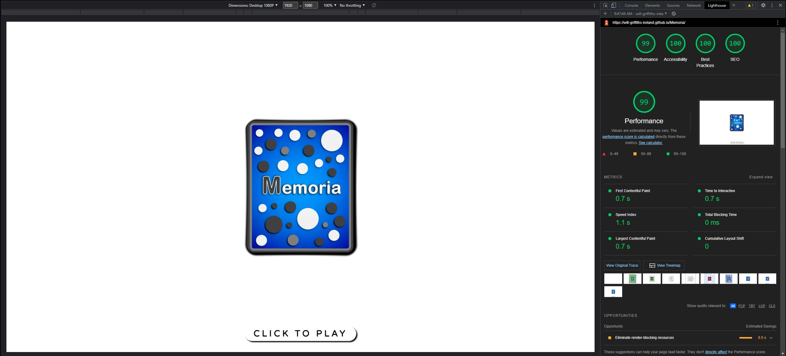
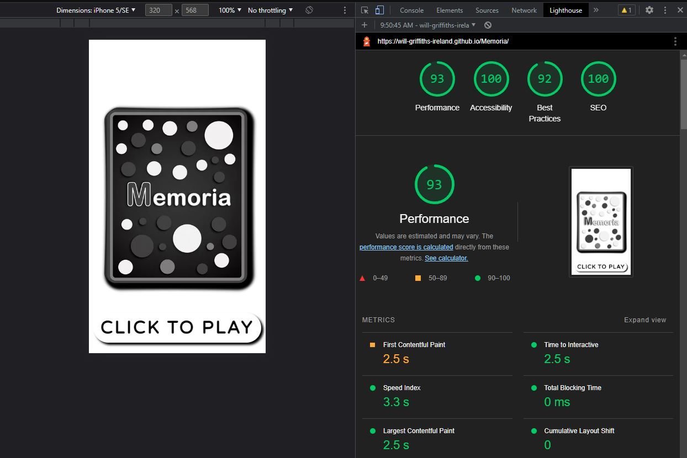

# Memoria
## **Game Overview**

Memoria is a vibrant, card based, memory challenge game for all ages.
There are 6 core family friendly themes and icon sets, with 2 themes that use all icons.
Players are shown an increasing number of cards, that they need to remember, in order, to win.
​

#### [The deployed website is here on GitHub Pages](https://will-griffiths-ireland.github.io/Memoria/)​

## Table of contents:
1. [**Game Overview**](#game-overview)
1. [**Planning stage**](#planning-stage)
    * [***Planning Overview***](#planning-overview)
    * [***Target Audiences***](#target-audiences)
    * [***User Stories***](#user-stories)
    * [***Game Aims***](#Game-aims)
    * [***Wireframes***](#wireframes)
    * [***Color Scheme***](#color-scheme)
    * [***Typography***](#typography)
1. [**Game Features**](#game-features)
    * [***Intro***](#intro)
    * [***Player Greeting***](#player-greeting)
    * [***Theme Menu***](#theme-menu)
    * [***Menu Icons***](#menu-icons)
    * [***Main Game***](#main-game)
    * [***Victory Animation***](#victory-animation)
    * [***Awards***](#awards)
    * [***Music & Effects***](#music-effects)
    * [***Settings***](#settings)

1. [**Testing Phase**](#testing-phase)
    * [***Validators***](#validators)
1. [**Deployment**](#deployment)
1. [**Technology**](#technology)
1. [**Future-Enhancements**](#future-enhancements)
    * [***User Enhancements***](#user_enhacements)
    * [***Internal Enhancements***](#internal_enhacements)
1. [**Credits**](#credits)
    * [**Honorable mentions**](#honorable-mentions)
    * [**Content**](#content)
    * [**Media**](#media)

---

## **Planning Stage**

### **Planning Overview:**

My aim with the game was to create something simple and engaging that helps the player flex their memory muscle.
There are benefits to both children and adults when they engage in an activity that stimulates memory.
When planning Memoria I kept my focus on the player and making a memory game that had a really simple core gameplay loop, but had an increasing memory challenge factor.
My main aims for the game were…

* Easy initial rounds give player satisfaction but quickly get challenging
* Clean interface to emulate a big tidy table
* Distinctive cards with the same ‘feel’ as regular playing cards
* Multiple themes linked to a colour and a set of related icons
* Easily rememberable icons that are clear at small screen sizes
* Engaging animations that add to the player experience and contribute to the challenge
* Progression in difficulty with rewards that drive the player to come back
* Storing player details, settings, and progression
* Allowing some level of customization the player could select
* A mode that would push even the best memories to the limit
* A hidden 'Easter Egg' theme

### **Target Audiences:**

* Children of any ability level
* Adults looking for a quick game with a challenge
* Adults with neurological conditions, such as Alzheimer's or dementia that can benefit from cognitive stimulation

### **User Stories:**

* As a player, I want the game to load quickly on my device
* As a player, I want a fun and engaging experience
* As a player, I want to have a clear objective that provides a challenge
* As a player, I want progression and reward
* As a player, I want to save my game settings
* As a player, I want options to configure the game specifically to me
* As a player, I want to configure the game to match my devices abilities
* As a player, I want quick access to control audio
* As a player, I want feedback on success or failure

### **Game Aims:**

* The game should, scale the interface to the users device
* The game should, allow the player to zoom the interface and scale proportionally
* The game should, present the user with multiple game themes
* The game should, provide detail on how to play
* The game should, show the players existing achievements or awards
* The game should, save any settings the player modifies
* The game should, start muted and allow players to enable effects and music
* The game should, allow the player to switch between light and dark theme

### **Wireframes:**

The initial wireframes were a few pages as I was aiming for a really clean interface.
I had a good idea of the look I wanted. The design did evolve during dev but nothing major from my original vision

​
### **Color Scheme:**

The core color scheme for the UI is black (#000000) and white (#ffffff)
The icons and menus were designed with high contrast in mind.
The user has the ability to quickly change between light/dark, I carefully designed the UI to maintain contrast at all times.
Hover events use red #FE0002.
Drop shadows use black.

Grey (#908e8ef4) is used to add some variation in the settings menu for example while staying neutral to the users preference of dark/light theme.
Note the use of alpha transparency (#fffffff4) on the backgrounds colours. This allow for both a sense of depth and also knocks down the vibrance of the white menus when the user has picked dark mode.

The star of the game is the cards and I've done my best to create vibrant assets with depth and character.
The core colors use gradients to give them a 3d element.

### **Design Choices**
​
The overall esthetic I based around the cards. The tactile feel and rounded edges are something I've try to seed throughout the game.
Menus are rounded, buttons are rounded, cards are rounded off.
The entire experience is designed to be smooth and relaxing.

#### **Fonts**

The font used on the cards was Arial Rounded MT Bold.
The UI uses Varela Round from Google Fonts with a fallback to sans-serif.

I made the decision to use uppercase across everything in the UI. After testing different styles it just felt like the right fit for readability and the look I wanted.

#### **Animations**

The flow of the game is smooth with objects dropping in from 0 opacity and larger scales. Cards have a flip animation that is not only for esthetics but plays an important part in the gameplay loop.

The delay in player card selection is deliberate and drives them to commit cards to short term memory rather than pure memory reflect reactions.
There is also an element of patience that is required.

Other animations aim to give smooth transitions between menus and the main game

#### **Accessibility**

The colours are high contrast, the card assets are all distinct colours.

The dark/light switch accommodates those with possible light sensitivity.

I designed it so colour matching is not important across all but the mixed mode. If the player has some sensitivity to colour they can play in mono mode with the entire selection of all icons.

The interface is is designed with a break at 900px width and a step up in all the units, this covers smaller mobile/tablets and then larger displays (I've tested this from phone screens up to a 4k TV). The use of rem across all the UI allows the player to zoom or shrink as required to meet any individual needs.

I gave a lot of consideration to those with reduced motion preferences for animations and I did try to implement a setting but I found this became very jarring with the way I had designed the game.
From an animations perspective I see it as a future enhancement to create a whole new display function that utilizes other methods such as onscreen timers.

---
​
## **Individual  features**

### **Intro Page Content**

* ??

#### *Desktop @1080p Example*

??

#### *Mobile Example*

??

---
## **Testing Phase**

Throughout development I thoroughly tested each piece of code from a core logic perspective and a visual one, before commits.
My approach to testing is to do everything I can, from an end user perspective, to break the application. Always expect the unexpected click!
Please note all testing code & comments were removed from final production code.
The general dev cycle testing procedure was..

* Add console logging for every variable
* Verify results of calculations were as expected
* Add console logging of all function executions and conditional tests
* Verify outcomes were as expected
* Using Chrome Devtools verify DOM manipulations were successful and as expected
 

A suite of final tests were performed once I felt the application was code complete.
These are based around the end to end player journey as a new and returning player.
Tests were done across...
* Chrome(Windows)
* Firefox(Windows) 
* Edge(windows)
* Safari(IpadOS)
* Chrome(Android)
* Samsung Internet(Android)
* Steam Deck (Chrome on Linux)

To save screen space below the result field will be a combination of all platforms and notes will call out details of any failures or issues

Note - I did get it running fine on a Steam Deck. Here are some images

----

----

 

### 1. Verify that intro screen displays correctly and interaction is successful

| Sub Test | Result | Note | 
| ----------- | ----------- | ---- |
| Loads OK | Pass |  |
| Rendering is fluid | Pass |  |
| Continue button displays | Pass |  |
| Click/tap results in user capture screen| Pass |  |
| Image & Text clear| Pass | |

### 2. Verify that player greeting displays correctly and interaction is successful

| Sub Test | Result | Note |
| ----------- | ----------- | ---- |
| Name entry works | Pass |  |
| Modal is centered and text clear | Pass |  |
| Returning player greeted with name | Pass |  |
| Returning player given continue option | Pass | |
| Returning player provide reset game option | Pass | |
| Reset game tap/click shows red confirm warning | Pass | |

### 3. Verify main menu displays correctly and interaction is successful

| Sub Test | Result | Note |
| ----------- | ----------- | ---- |
| Menu centered | Pass | |
| Theme names display | Pass | |
| Emma theme shown is username of Emma was used | Pass | |
| All menu icons displaying | Pass | |
| Theme award stars display if any achieved | Pass | |
| Music on/off changes icon and starts/stops menu music | Partial Pass | No fade in IOS due to system limitations on volume access |
| Effects on/off changes icon and enables/disables effects  | Pass | |
| All themes trigger game of that theme type | Pass | |
| Menu icon triggers opening or closing of menu | Pass | |
| Escape key triggers opening or closing of menu (PC) | Pass | |
| Layout scales with browser zoom  | Pass | |
| Animations and transitions correct  | Pass | |
| Game tutorial icon triggers tutorial display  | Pass | |
| Other settings icon triggers other settings menu  | Pass | |
| Menu icon clicks close current modal if one is open  | Pass | |

### 4. Verify main game works as expected and responds to player input

| Sub Test | Result | Note |
| ----------- | ----------- | ---- |
| Starts at round 1 on initial launch | Pass |  |
| Theme and round count display | Pass |  |
| Layout scales with browser zoom  | Pass |  |
| Cards to match display | Pass |  |
| If enabled menu music fades and game music starts | Partial Pass | IOS no fade |
| If enabled effects play | Partial Pass | IOS will only play effects directly lined to user actions |
| Animations timings correct | Pass |  |
| Player can select card | Pass |  |
| Correct card selection results in card to match be flipped | Pass |  |
| Correct card selection results round counter displaying win message | Pass |  |
| All correct cards selected shows win animation | Pass |  |
| All correct cards selected shows win message in round counter | Pass |  |
| Incorrect card selection results in all cards being shown | Pass |  |
| Incorrect card selection shows round counter displaying loose message | Pass |  |
| Incorrect card selection results in fade back to main menu | Pass |  |
| Incorrect card selection results, if enabled, in game music fade and menu music play | Pass |  |

### **Validators**

#### *HTML Validator*

Since nearly all the html is injected by Javascript the HTML validator does not have much to check

| File | Result | Comments |
| ----------- | ----------- | ---- |
| index.html | Pass | N\A |

Screenshot

----

#### *CSS Validator*

| File | Result | Comments |
| ----------- | ----------- | ---- |
| style.css | 16 Errors | The validator is flagging properties for not existing |

The rotate property is valid and I'm using it to slightly rotate dropping cards for an intro screen.
See - https://www.w3schools.com/cssref/css_pr_rotate.php

Screenshot

----

#### *Lighthouse Results*

Lighthouse scores are fair but ultimately not very telling on the apps performance.
I did encounter issues with the time it took for the google icon font pack to download but from my testing this seems to vary with the time of day and doesn't impact usability.

*Desktop*

*Mobile*

## **Defects**

Rigorous testing of my code while I built it paid off when it came to testing the end product.

### **Resolved**

??

### **Unresolved**

??

## **Deployment**
I deployed the page on GitHub pages via the following the standard procedure: -
​
1. From the project's [repository](https://github.com/Will-Griffiths-Ireland/Mars-Colony-One), go to the **Settings** tab.
2. From the left-hand menu, select the **Pages** tab.
3. Under the **Source** section, select the **Main** branch from the drop-down menu and click **Save**.
4. A message will be displayed to indicate a successful deployment to GitHub pages and provide the live link.
​
You can find the live site via the following URL - [live webpage](https://will-griffiths-ireland.github.io/Memoria/)

Deployment to another host is also possible

1. From the project's [repository](https://github.com/Will-Griffiths-Ireland/Mars-Colony-One), click **Code**.
2. Under the local tab click *Download Zip*.
3. Extract the files and copy them over to a webserver of your choice.

### **To fork the repository on GitHub** 
  
To make a copy of this GitHub repository that allows you to view the content and make changes without affecting the original repository, please take the following steps:
  
1. Login to <b>GitHub</b> and find [this repository](https://github.com/Will-Griffiths-Ireland/Memoria).
2. Locate the <b>Fork</b> button in the top, right hand side of the page.
3. Click on the <b>Fork</b> button to create a copy of the repository in your GitHub account.
4. Enjoy yourself and be creative, I welcome feedback if you have any to give!

---
​
## **Technology**
​
These are the technologies used for this project.

- HTML5
- CSS3
- Javascript (vanilla)
- Powerpoint (cards)
- Balsamiq for wireframes
- Paint.net (Image editing/sizing/compression)
- XnCovert (image resizing)
- Audacity (Sound Editing)
- Garage Band (Song Creation)
- Github for version control and deployment
- Gitpod for development
- FontAwesome for Icons
- https://cssgradient.io/ (gradient code generator)
- https://favicon.io/favicon-generator/ 

----

## **Future-Enhancements**

??

### **User Enhancements**

* Expanded music that is custom to each theme
* Convert to IOS & Android apps

### **Internal Enhancements**

* Modularize JS into multiple files
* Refactor code further to reduce size and

## **Credits**
### **Honorable mentions**
​
Thanks to my mentor Richard who provided valuable input and direction!

??
​
### **Content:**
​
The game concept is my original idea.
  
### **Media:**
​
* All images were self created in MS Powerpoint using inbuilt icons
* All sound effects and music was self created using Audacity and Garage Band

